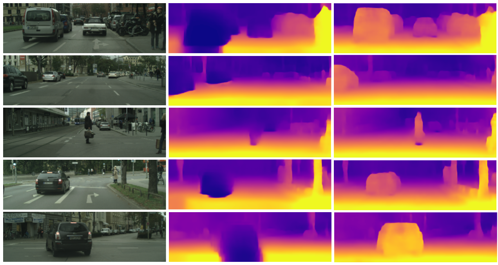

# Awesome-Depth-Estimation

------

Hi there :wave: 

This awesome list is under construction. If you have anything to recommend or any suggestions, please feel free to contact us via e-mail (wa09@link.cuhk.edu.hk | 1155178600@link.cuhk.edu.hk) or directly push a PR :smiley: 

**< Last updated: 15/12/2023 >**

## 1. Content
- [Awesome-Depth-Estimation](#awesome-depth-estimation)
  - [1. Content](#1-content)
  - [2. Paper List](#2-paper-list)
    - [2.1. Datasets \& Benchmarks](#21-datasets--benchmarks)
    - [2.2. General Depth Estimation](#22-general-depth-estimation)
      - [2.2.1. YEAR 2023](#221-year-2023)
    - [2.3. Surgical Depth Estimation](#23-surgical-depth-estimation)
      - [2.3.1. YEAR 2023](#231-year-2023)

## 2. Paper List

### 2.1. Datasets & Benchmarks

|                 Dataset Name                  | Year | Publication |                            Links                             |
| :-------------------------------------------: | :--: | :---------: | :----------------------------------------------------------: |
| Multi-Spectral Stereo Outdoor Driving Dataset | 2023 |    CVPR     | **[Paper](https://openaccess.thecvf.com/content/CVPR2023/html/Shin_Deep_Depth_Estimation_From_Thermal_Image_CVPR_2023_paper.html)** |

### 2.2. General Depth Estimation

#### 2.2.1. YEAR 2023

| Year |                        Model & Method                        |                         Publication                          | Title                                                        | Links                                                        |
| :--: | :----------------------------------------------------------: | :----------------------------------------------------------: | :----------------------------------------------------------- | :----------------------------------------------------------- |
| 2023 |                 Transformer, Cross-attention                 | IEEE Transactions on Pattern Analysis and Machine Intelligence | Unifying Flow, Stereo and Depth Estimation                   | **[Paper](https://ieeexplore.ieee.org/abstract/document/10193833)**/Code |
| 2023 |                            md4all                            |                             ICCV                             | Robust Monocular Depth Estimation under Challenging Conditions | **[Paper](https://openaccess.thecvf.com/content/ICCV2023/papers/Gasperini_Robust_Monocular_Depth_Estimation_under_Challenging_Conditions_ICCV_2023_paper.pdf)**/**[Code](https://md4all.github.io/)** |
| 2023 |                              -                               |                             WACV                             | The Monocular Depth Estimation Challenge                     | **[Paper](https://openaccess.thecvf.com/content/WACV2023W/MDEC/papers/Spencer_The_Monocular_Depth_Estimation_Challenge_WACVW_2023_paper.pdf)**/Code |
| 2023 |                              -                               |                             WACV                             | The Second Monocular Depth Estimation Challenge              | **[Paper](https://openaccess.thecvf.com/content/CVPR2023W/MDEC/papers/Spencer_The_Second_Monocular_Depth_Estimation_Challenge_CVPRW_2023_paper.pdf)**/Code |
| 2023 |      Physics (geometry)-driven deep learning framework       |                             ICCV                             | NDDepth: Normal-Distance Assisted Monocular Depth Estimation | **[Paper](https://openaccess.thecvf.com/content/ICCV2023/papers/Shao_NDDepth_Normal-Distance_Assisted_Monocular_Depth_Estimation_ICCV_2023_paper.pdf)**/**[Code](https://github.com/ShuweiShao/NDDepth)** |
| 2023 | A parallel encoder architecture consisting of a Transformer branch and a convolution branch |                Machine Intelligence Research                 | DepthFormer: Exploiting Long-range Correlation and Local Information for Accurate Monocular Depth Estimation | **[Paper](https://link.springer.com/article/10.1007/s11633-023-1458-0)**/Code |
| 2023 | An effective method for creating temporal stereo by dynamically determining the center and range of the temporal stereo |                             AAAI                             | BEVStereo: Enhancing Depth Estimation in Multi-View 3D Object Detection with Temporal Stereo | **[Paper](https://ojs.aaai.org/index.php/AAAI/article/view/25234)**/Code |
| 2023 |    CNNs, Transformers, and CNN-Transformer hybrid models     |                             AAAI                             | Deep Digging into the Generalization of Self-Supervised Monocular Depth Estimation | **[Paper](https://ojs.aaai.org/index.php/AAAI/article/view/25090)**/Code |
| 2023 |                 HRDFuse(CNNs + transformers)                 |                             CVPR                             | HRDFuse: Monocular 360deg Depth Estimation by Collaboratively Learning Holistic-With-Regional Depth Distributions | **[Paper](https://openaccess.thecvf.com/content/CVPR2023/papers/Ai_HRDFuse_Monocular_360deg_Depth_Estimation_by_Collaboratively_Learning_Holistic-With-Regional_Depth_CVPR_2023_paper.pdf)**/Code |
| 2023 |                       Diffusion Models                       |                            arXiv                             | Monocular Depth Estimation using Diffusion Models            | **[Paper](https://arxiv.org/abs/2302.14816)**/**[Code](https://depth-gen.github.io/)** |
| 2023 |                  Cross-view self-attention                   |                             PMLR                             | SurroundDepth: Entangling Surrounding Views for Self-Supervised Multi-Camera Depth Estimation | **[Paper](https://proceedings.mlr.press/v205/wei23a.html)**/Code |
| 2023 |                 Internal Discretization (ID)                 |                             CVPR                             | iDisc: Internal Discretization for Monocular Depth Estimation | **[Paper](https://openaccess.thecvf.com/content/CVPR2023/html/Piccinelli_iDisc_Internal_Discretization_for_Monocular_Depth_Estimation_CVPR_2023_paper.html)**/**[Code](http://vis.xyz/pub/idisc/)** |
| 2023 |            Consistent Online Dynamic Depth (CODD)            |                             WACV                             | Temporally Consistent Online Depth Estimation in Dynamic Scenes | **[Paper](https://openaccess.thecvf.com/content/WACV2023/html/Li_Temporally_Consistent_Online_Depth_Estimation_in_Dynamic_Scenes_WACV_2023_paper.html)**/Code |
| 2023 |                           DPS-Net                            |                             ICCV                             | DPS-Net: Deep Polarimetric Stereo Depth Estimation           | **[Paper](https://openaccess.thecvf.com/content/ICCV2023/papers/Tian_DPS-Net_Deep_Polarimetric_Stereo_Depth_Estimation_ICCV_2023_paper.pdf)**/Code |
| 2023 |                   Two-View Pose Estimator                    |                             CVPR                             | LightedDepth: Video Depth Estimation in Light of Limited Inference View Angles | **[Paper](https://openaccess.thecvf.com/content/CVPR2023/papers/Zhu_LightedDepth_Video_Depth_Estimation_in_Light_of_Limited_Inference_View_CVPR_2023_paper.pdf)**/**[Code](https://github.com/ShngJZ/LightedDepth)** |
| 2023 |      SABV-Depth (based on the self-attention mechanism)      |                   Knowledge-Based Systems                    | SABV-Depth: A biologically inspired deep learning network for monocular depth estimation | **[Paper](https://www.sciencedirect.com/science/article/pii/S0950705123000515?via%3Dihub)**/Code |
| 2023 |                          SC-DepthV3                          | IEEE Transactions on Pattern Analysis and Machine Intelligence | SC-DepthV3: Robust Self-Supervised Monocular Depth Estimation for Dynamic Scenes | **[Paper](https://ieeexplore.ieee.org/abstract/document/10273446)**/Code |
| 2023 |                    Pseudo-supervised loss                    |                             ICCV                             | Self-supervised Monocular Depth Estimation: Let's Talk About The Weather | **[Paper](https://openaccess.thecvf.com/content/ICCV2023/papers/Saunders_Self-supervised_Monocular_Depth_Estimation_Lets_Talk_About_The_Weather_ICCV_2023_paper.pdf)**/**[Code](https://kieran514.github.io/Robust-Depth-Project/)** |
| 2023 | Fit a neural RGB-D representation to long-burst data and simultaneously estimates scene depth and camera motion |                             CVPR                             | Shakes on a Plane: Unsupervised Depth Estimation From Unstabilized Photography | **[Paper](https://openaccess.thecvf.com/content/CVPR2023/html/Chugunov_Shakes_on_a_Plane_Unsupervised_Depth_Estimation_From_Unstabilized_Photography_CVPR_2023_paper.html)**/Code |
| 2023 | Exploit GCN for a self-supervised monocular depth estimation model |                        Neurocomputing                        | GCNDepth: Self-supervised monocular depth estimation based on graph convolutional network | **[Paper](https://www.sciencedirect.com/science/article/pii/S0925231222013601)**/**[Code](https://github.com/ArminMasoumian/GCNDepth.git)** |
| 2023 |                     Gated fusion scheme                      |                             CVPR                             | Depth Estimation From Camera Image and mmWave Radar Point Cloud | **[Paper](https://openaccess.thecvf.com/content/CVPR2023/papers/Singh_Depth_Estimation_From_Camera_Image_and_mmWave_Radar_Point_Cloud_CVPR_2023_paper.pdf)**/**[Code](https://github.com/nesl/)** |
| 2023 |                        DPT algorithm                         |                             CVPR                             | High-Resolution Synthetic RGB-D Datasets for Monocular Depth Estimation | **[Paper](https://openaccess.thecvf.com/content/CVPR2023W/NTIRE/papers/Rajpal_High-Resolution_Synthetic_RGB-D_Datasets_for_Monocular_Depth_Estimation_CVPRW_2023_paper.pdf)**/Code |
| 2023 |                 knowledge distillation (KD)                  | International Conference on Knowledge Science, Engineering and Management | Boosting LightWeight Depth Estimation via Knowledge Distillation | **[Paper](https://link.springer.com/chapter/10.1007/978-3-031-40283-8_3)**/Code |
| 2023 |                  Domain adaptation approach                  |           International Journal of Computer Vision           | DESC: Domain Adaptation for Depth Estimation via Semantic Consistency | **[Paper](https://link.springer.com/article/10.1007/s11263-022-01718-1)**/**[Code](https://github.com/alopezgit/DESC)** |
| 2023 |                             CNN                              |      ISPRS Journal of Photogrammetry and Remote Sensing      | Snow depth estimation at country-scale with high spatial and temporal resolution | **[Paper](https://www.sciencedirect.com/science/article/pii/S0924271623000230)**/Code |
| 2023 | Consider the task of depth estimation as a ranking problem, i.e., for a given pair of points, we estimate which point is nearer to the camera |                             CVPR                             | Analyzing Results of Depth Estimation Models With Monocular Criteria | **[Paper](https://openaccess.thecvf.com/content/CVPR2023W/XAI4CV/papers/Theiner_Analyzing_Results_of_Depth_Estimation_Models_With_Monocular_Criteria_CVPRW_2023_paper.pdf)**/Code |
| 2023 |                         360MonoDepth                         |                             CVPR                             | High-Resolution Depth Estimation for 360deg Panoramas Through Perspective and Panoramic Depth Images Registration | **[Paper](https://openaccess.thecvf.com/content/WACV2023/html/Peng_High-Resolution_Depth_Estimation_for_360deg_Panoramas_Through_Perspective_and_Panoramic_WACV_2023_paper.html)**/Code |
| 2023 | Propose a learning framework that trains models to predict geometry-preserving depth without requiring extra data or annotations |                             ICCV                             | Robust Geometry-Preserving Depth Estimation Using Differentiable Rendering | **[Paper](https://openaccess.thecvf.com/content/ICCV2023/papers/Zhang_Robust_Geometry-Preserving_Depth_Estimation_Using_Differentiable_Rendering_ICCV_2023_paper.pdf)**/Code |
| 2023 |             Combination of CNNs and Transformers             |                             CVPR                             | Lite-Mono: A Lightweight CNN and Transformer Architecture for Self-Supervised Monocular Depth Estimation | **[Paper](https://openaccess.thecvf.com/content/CVPR2023/papers/Zhang_Lite-Mono_A_Lightweight_CNN_and_Transformer_Architecture_for_Self-Supervised_Monocular_CVPR_2023_paper.pdf)**/**[Code](https://github.com/noahzn/Lite-Mono)** |
| 2023 |                            EPNet                             |                             AAAI                             | Efficient Edge-Preserving Multi-View Stereo Network for Depth Estimation | **[Paper](https://ojs.aaai.org/index.php/AAAI/article/view/25330)**/**[Code](https://github.com/susuwj/EPNet)** |
| 2023 |            A novel memory and attention framework            |                             ICCV                             | MAMo: Leveraging Memory and Attention for Monocular Video Depth Estimation | **[Paper](https://openaccess.thecvf.com/content/ICCV2023/papers/Yasarla_MAMo_Leveraging_Memory_and_Attention_for_Monocular_Video_Depth_Estimation_ICCV_2023_paper.pdf)**/Code |
| 2023 |      UDepth (MobileNetV2, Transformer-based optimizer)       |                             ICRA                             | UDepth: Fast Monocular Depth Estimation for Visually-guided Underwater Robots | **[Paper](https://ieeexplore.ieee.org/abstract/document/10161471)**/**[Code](https://github.com/uf-robopi/UDepth)** |
| 2023 |                             CNN                              |           Computers and Electronics in Agriculture           | Accurate detection and depth estimation of table grapes and peduncles for robot harvesting, combining monocular depth estimation and CNN methods | **[Paper](https://www.sciencedirect.com/science/article/pii/S0168169923007500)**/Code |
| 2023 | Propose an initialization method for the network weights based on the Manhattan World Assumption |                             CVPR                             | Depth Estimation From Indoor Panoramas With Neural Scene Representation | **[Paper](https://openaccess.thecvf.com/content/CVPR2023/papers/Chang_Depth_Estimation_From_Indoor_Panoramas_With_Neural_Scene_Representation_CVPR_2023_paper.pdf)**/**[Code](https://github.com/WJ-Chang-42/IndoorPanoDepth)** |
| 2023 | Propose to detect OOD images from an encoder-decoder depth estimation model based on the reconstruction error |                             ICCV                             | Out-of-Distribution Detection for Monocular Depth Estimation | **[Paper](https://openaccess.thecvf.com/content/ICCV2023/papers/Hornauer_Out-of-Distribution_Detection_for_Monocular_Depth_Estimation_ICCV_2023_paper.pdf)**/Code |
| 2023 | Propose a novel approach that utilizes both local and global features in the cost volume for depth estimation |                             CVPR                             | Disentangling Local and Global Information for Light Field Depth Estimation | **[Paper](https://openaccess.thecvf.com/content/CVPR2023W/LFNAT/papers/Yang_Disentangling_Local_and_Global_Information_for_Light_Field_Depth_Estimation_CVPRW_2023_paper.pdf)**/Code |
| 2023 | Self-reprojection mask, self-statistical mask, self-distillation augmentation |  IEEE Transactions on Neural Networks and Learning Systems   | Self-Supervised Monocular Depth Estimation With Self-Perceptual Anomaly Handling | **[Paper](https://ieeexplore.ieee.org/abstract/document/10219178)**/Code |
| 2023 | A two-stage attention-based occlusion-aware light field depth estimation network |               Optics and Lasers in Engineering               | Occlusion-aware light field depth estimation with view attention | **[Paper](https://www.sciencedirect.com/science/article/abs/pii/S0143816622003529)**/Code |
| 2023 | Estimate temporally consistent depth maps of video streams in an online setting |                             CVPR                             | Temporally Consistent Online Depth Estimation Using Point-Based Fusion | **[Paper](https://openaccess.thecvf.com/content/CVPR2023/papers/Khan_Temporally_Consistent_Online_Depth_Estimation_Using_Point-Based_Fusion_CVPR_2023_paper.pdf)**/Code |
| 2023 |          EPI, multi-view depth integration strategy          |                     Pattern Recognition                      | Accurate light field depth estimation under occlusion        | **[Paper](https://www.sciencedirect.com/science/article/abs/pii/S0031320323001164)**/Code |
| 2023 |                          RoboDepth                           |                            arXiv                             | RoboDepth: Robust Out-of-Distribution Depth Estimation under Corruptions | **[Paper](https://arxiv.org/abs/2310.15171)**/Code           |
| 2023 |                       Ground attention                       |                             ICCV                             | GEDepth: Ground Embedding for Monocular Depth Estimation     | **[Paper](https://openaccess.thecvf.com/content/ICCV2023/papers/Yang_GEDepth_Ground_Embedding_for_Monocular_Depth_Estimation_ICCV_2023_paper.pdf)**/Code |
| 2023 | Self-supervised deep learning, joint depth and ego-motion estimation |                             PMLR                             | When the Sun Goes Down: Repairing Photometric Losses for All-Day Depth Estimation | **[Paper](https://proceedings.mlr.press/v205/vankadari23a.html)**/Code |
| 2023 |         Redesign the patch-based triplet loss in MDE         |                             WACV                             | Self-Supervised Monocular Depth Estimation: Solving the Edge-Fattening Problem | **[Paper](https://openaccess.thecvf.com/content/WACV2023/papers/Chen_Self-Supervised_Monocular_Depth_Estimation_Solving_the_Edge-Fattening_Problem_WACV_2023_paper.pdf)**/Code |
| 2023 |                              -                               |                             CVPR                             | LFNAT 2023 Challenge on Light Field Depth Estimation: Methods and Results | **[Paper](https://openaccess.thecvf.com/content/CVPR2023W/LFNAT/html/Sheng_LFNAT_2023_Challenge_on_Light_Field_Depth_Estimation_Methods_and_CVPRW_2023_paper.html)**/Code |
| 2023 |       Self-supervised depth estimation with semantics        |                     Pattern Recognition                      | Learning depth via leveraging semantics: Self-supervised monocular depth estimation with both implicit and explicit semantic guidance | **[Paper](https://www.sciencedirect.com/science/article/abs/pii/S0031320322007762)**/Code |
| 2023 |                           CNN-LSTM                           |                    NDT & E International                     | Automatic defect depth estimation for ultrasonic testing in carbon fiber reinforced composites using deep learning | **[Paper](https://www.sciencedirect.com/science/article/abs/pii/S0963869523000191)**/Code |
| 2023 |                         Transformer                          |                             ICRA                             | TODE-Trans: Transparent Object Depth Estimation with Transformer | **[Paper](https://ieeexplore.ieee.org/abstract/document/10160537)**/**[Code](https://github.com/yuchendoudou/TODE)** |
| 2023 |    Semi-supervised, domain-adaptive semantic segmentation    |           International Journal of Computer Vision           | Improving Semi-Supervised and Domain-Adaptive Semantic Segmentation with Self-Supervised Depth Estimation | **[Paper](https://link.springer.com/article/10.1007/s11263-023-01799-6)**/**[Code](https://github.com/lhoyer/improving_segmentation_with_selfsupervised_depth)** |
| 2023 |          Summarize the LF depth estimation methods           |                  High-Confidence Computing                   | Light field depth estimation: A comprehensive survey from principles to future | **[Paper](https://www.sciencedirect.com/science/article/pii/S2667295223000855)**/Code |
| 2023 |               Densely estimating metric depth                |           Computer Vision and Image Understanding            | LiDARTouch: Monocular metric depth estimation with a few-beam LiDAR | **[Paper](https://www.sciencedirect.com/science/article/abs/pii/S1077314222001795)**/Code |
| 2023 |              Multi-head attention (MHA) modules              |                             CVPR                             | Trap Attention: Monocular Depth Estimation With Manual Traps | **[Paper](https://openaccess.thecvf.com/content/CVPR2023/papers/Ning_Trap_Attention_Monocular_Depth_Estimation_With_Manual_Traps_CVPR_2023_paper.pdf)**/**[Code](https://github.com/ICSResearch/TrapAttention)** |
| 2023 | CSMHNet (a hybrid of a Convolution, self-attention, and an MLP network) |     Engineering Applications of Artificial Intelligence      | Self-supervised monocular depth estimation based on combining convolution and multilayer perceptron | **[Paper](https://www.sciencedirect.com/science/article/abs/pii/S0952197622005772)**/Code |
| 2023 |    Direction-aware Cumulative Convolution Network (DaCCN)    |                             CVPR                             | Self-Supervised Monocular Depth Estimation by Direction-aware Cumulative Convolution Network | **[Paper](https://openaccess.thecvf.com/content/ICCV2023/papers/Han_Self-Supervised_Monocular_Depth_Estimation_by_Direction-aware_Cumulative_Convolution_Network_ICCV_2023_paper.pdf)**/Code |
| 2023 |                              -                               |           IPOL Journal · Image Processing On Line            | Monocular Depth Estimation: a Review of the 2022 State of the Art | **[Paper](https://www.ipol.im/pub/art/2023/459/)**/Code      |
| 2023 | Two-in-One self-supervised depth estimation network, called TiO-Depth |                             ICCV                             | Two-in-One Depth: Bridging the Gap Between Monocular and Binocular Self-Supervised Depth Estimation | **[Paper](https://openaccess.thecvf.com/content/ICCV2023/papers/Zhou_Two-in-One_Depth_Bridging_the_Gap_Between_Monocular_and_Binocular_Self-Supervised_ICCV_2023_paper.pdf)**/**[Code](https://github.com/ZM-Zhou/TiO-Depth_pytorch)** |
| 2023 | PlaneDepth (Laplacian Mixture Model based on orthogonal planes for an input image) |                             CVPR                             | PlaneDepth: Self-Supervised Depth Estimation via Orthogonal Planes | **[Paper](https://openaccess.thecvf.com/content/CVPR2023/papers/Wang_PlaneDepth_Self-Supervised_Depth_Estimation_via_Orthogonal_Planes_CVPR_2023_paper.pdf)**/**[Code](https://github.com/svip-lab/PlaneDepth)** |
| 2023 |                       CNNs (ResNet50)                        |               Expert Systems with Applications               | Analyzing CARLA ’s performance for 2D object detection and monocular depth estimation based on deep learning approaches | **[Paper](https://www.sciencedirect.com/science/article/abs/pii/S0957417423007029)**/Code |
| 2023 |               Uncertain pixel masking strategy               |                            arXiv                             | STEPS: Joint Self-supervised Nighttime Image Enhancement and Depth Estimation | **[Paper](https://arxiv.org/abs/2302.01334)**/**[Code](https://github.com/ucaszyp/STEPS)** |
| 2023 | Two-headed Depth Estimation and Deblurring Network (2HDED:NET) |          IEEE Transactions on Computational Imaging          | Depth Estimation and Image Restoration by Deep Learning From Defocused Images | **[Paper](https://ieeexplore.ieee.org/abstract/document/10158786)**/Code |
| 2023 |                      Transformer, CNNs                       |                            ISMAR                             | MonoVAN: Visual Attention for Self-Supervised Monocular Depth Estimation | **[Paper](https://www.computer.org/csdl/proceedings-article/ismar/2023/283800b211/1SBJb8OiP5K)**/**[Code](https://github.com/IlyaInd/MonoVAN)** |
| 2023 |                          CNNs, MLP                           |                The Journal of Supercomputing                 | Car depth estimation within a monocular image using a light CNN | **[Paper](https://link.springer.com/article/10.1007/s11227-023-05359-0)**/Code |
| 2023 |                  Self-supervised framework                   |                             CVPR                             | Fully Self-Supervised Depth Estimation From Defocus Clue     | **[Paper](https://openaccess.thecvf.com/content/CVPR2023/papers/Si_Fully_Self-Supervised_Depth_Estimation_From_Defocus_Clue_CVPR_2023_paper.pdf)**/**[Code](https://github.com/Ehzoahis/DEReD)** |
| 2023 |                          Attention                           |                             CVPR                             | EGA-Depth: Efficient Guided Attention for Self-Supervised Multi-Camera Depth Estimation | **[Paper](https://openaccess.thecvf.com/content/CVPR2023W/WAD/papers/Shi_EGA-Depth_Efficient_Guided_Attention_for_Self-Supervised_Multi-Camera_Depth_Estimation_CVPRW_2023_paper.pdf)**/Code |
| 2023 |              Binocular depth estimation network              |                             CVPR                             | OmniVidar: Omnidirectional Depth Estimation From Multi-Fisheye Images | **[Paper](https://openaccess.thecvf.com/content/CVPR2023/papers/Xie_OmniVidar_Omnidirectional_Depth_Estimation_From_Multi-Fisheye_Images_CVPR_2023_paper.pdf)**/Code |
| 2023 | Self-supervised learning, feature-level adversarial adaptation |                             WACV                             | Self-Supervised Monocular Depth Estimation From Thermal Images via Adversarial Multi-Spectral Adaptation | **[Paper](https://openaccess.thecvf.com/content/WACV2023/html/Shin_Self-Supervised_Monocular_Depth_Estimation_From_Thermal_Images_via_Adversarial_Multi-Spectral_WACV_2023_paper.html)**/Code |

### 2.3. Surgical Depth Estimation

#### 2.3.1. YEAR 2023

| Year |                        Model & Method                        |                         Publication                          | Title                                                        | Links                                                        |
| :--: | :----------------------------------------------------------: | :----------------------------------------------------------: | :----------------------------------------------------------- | :----------------------------------------------------------- |
| 2023 |                        Gradient loss                         |     Engineering Applications of Artificial Intelligence      | A geometry-aware deep network for depth estimation in monocular endoscopy | **[Paper](https://www.sciencedirect.com/science/article/abs/pii/S0952197623001732)**/**[Code](https://github.com/YYM-SIA/LINGMI-MR)** |
| 2023 |                             SLAM                             |              Computers in Biology and Medicine               | Sparse-to-dense coarse-to-fine depth estimation for colonoscopy | **[Paper](https://www.sciencedirect.com/science/article/abs/pii/S0010482523004481)**/Code |
| 2023 |                       Active inference                       |                             MDPI                             | Active Vision in Binocular Depth Estimation: A Top-Down Perspective | **[Paper](https://www.mdpi.com/2313-7673/8/5/445)**/Code     |
| 2023 | Spatiotemporal vision transformers-based self-supervised depth estimation |      IEEE Transactions on Medical Robotics and Bionics       | SVT-SDE: Spatiotemporal Vision Transformers-Based Self-Supervised Depth Estimation in Stereoscopic Surgical Videos | **[Paper](https://ieeexplore.ieee.org/abstract/document/10019782)**/Code |
| 2023 |       Combine both supervised and self-supervised loss       |                     Intelligent Medicine                     | ArthroNet: a monocular depth estimation technique with 3D segmented maps for knee arthroscopy | **[Paper](https://www.sciencedirect.com/science/article/pii/S2667102622000341)**/Code |
| 2023 | U-shape convolutional network with the dual-attention mechanism |         Computer Methods and Programs in Biomedicine         | Self-supervised monocular depth estimation for gastrointestinal endoscopy | **[Paper](https://www.sciencedirect.com/science/article/abs/pii/S0169260723002845)**/Code |
| 2023 |            Triple-supervision learning framework             |                            ICASSP                            | Deep Triple-Supervision Learning Unannotated Surgical Endoscopic Video Data for Monocular Dense Depth Estimation | **[Paper](https://ieeexplore.ieee.org/abstract/document/10097144)**/Code |
| 2023 |            Pixel-level depth map fusion algorithm            |      IEEE International Conference on Image Processing       | Dense Depth Estimation for Surgical Endoscope Robot with Multi-Baseline Depth Map Fusion | **[Paper](https://ieeexplore.ieee.org/abstract/document/10222752)**/Code |
| 2023 |                          NeRF, SLAM                          |                             MLMI                             | Towards Abdominal 3-D Scene Rendering from Laparoscopy Surgical Videos Using NeRFs | **[Paper](https://link.springer.com/chapter/10.1007/978-3-031-45673-2_9)**/Code |
| 2023 |    Self-supervised depth and ego-motion estimation system    |                            arXiv                             | WS-SfMLearner: Self-supervised Monocular Depth and Ego-motion Estimation on Surgical Videos with Unknown Camera Parameters | **[Paper](https://arxiv.org/abs/2308.11776)**/Code           |
| 2023 | Semantic-SuPer, that integrates geometric and semantic information to facilitate data association, 3D reconstruction, and tracking of endoscopic scenes, benefiting downstream tasks like surgical navigation |                             ICRA                             | Semantic-SuPer: A Semantic-aware Surgical Perception Framework for Endoscopic Tissue Identification, Reconstruction, and Tracking | **[Paper](https://ieeexplore.ieee.org/abstract/document/10160746)**/**[Code](https://github.com/ucsdarclab/Python-SuPer)** |
| 2023 | Second-order gradient of the image, second-order gradient of the parallax map |                            ICCECE                            | Monocular depth estimation based on Chained Residual Pooling and Gradient Weighted Loss | **[Paper](https://ieeexplore.ieee.org/abstract/document/10135509)**/Code |
| 2023 |               Self-supervised depth estimation               |                            arXiv                             | SemHint-MD: Learning from Noisy Semantic Labels for Self-Supervised Monocular Depth Estimation | **[Paper](https://arxiv.org/abs/2303.18219)**/Code           |
| 2023 |                      Regression network                      |                            MICCAI                            | Detecting the Sensing Area of a Laparoscopic Probe in Minimally Invasive Cancer Surgery | **[Paper](https://link.springer.com/chapter/10.1007/978-3-031-43996-4_25)**/**[Code](https://github.com/br0202/Sensing_area_detection)** |
| 2023 |                              -                               |            Journal of Physics: Conference Series             | A survey on deep learning for surgical planning              | **[Paper](https://iopscience.iop.org/article/10.1088/1742-6596/2580/1/012055/meta)**/Code |
| 2023 | cGAN-based network Bronchoscopic-Depth-GAN (BronchoDep-GAN)  | International Journal of Computer Assisted Radiology and Surgery | A cGAN-based network for depth estimation from bronchoscopic images | **[Paper](https://link.springer.com/article/10.1007/s11548-023-02978-z)**/Code |
| 2023 |                             NeFR                             |             Predictive Intelligence in Medicine              | Dynamic Depth-Supervised NeRF for Multi-view RGB-D Operating Room Videos | **[Paper](https://link.springer.com/chapter/10.1007/978-3-031-46005-0_19)**/Code |

